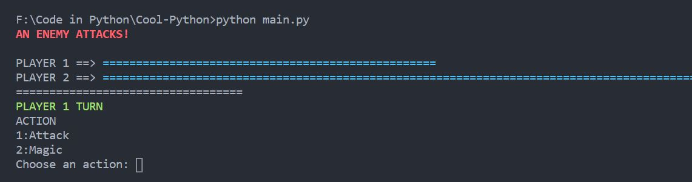
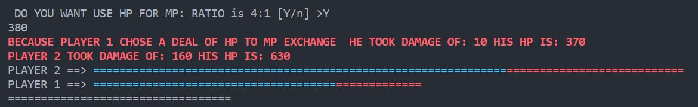

## This is a fun game playing project
* Works in the terminal
* Takes damage, plays and much more
* Highlight 29-02-2021: Ask for HP if no MP is left, balance is 4:1(i.e. 4MP takes 1HP)

### Sample Run
* The following image explains the User Experience and running process

* Above image has Blue ``=`` which is health of the each player

* Above Image describes the Highlight
* And the Health bar

### Multi Chat Room
* Under development, It aims to extract to broader lengths
* This may use an NLP template
Read more [here](Multi_chat_room/Readme.md)

## A visualizer for Tree Based algortihms
When we try to learn data structures, some of us have a hard time visualizing how the tree operations are carried out. So I am starting an initiative to visualize all the algorithms accordingly and try to make it reachable for everybody. Mostly graph based algorithms are tricker to understand thus it is hope of making data structures a little fun to study and visualize.

`This needs some work which is under continuation`
`Might expand to OOD paragidm`